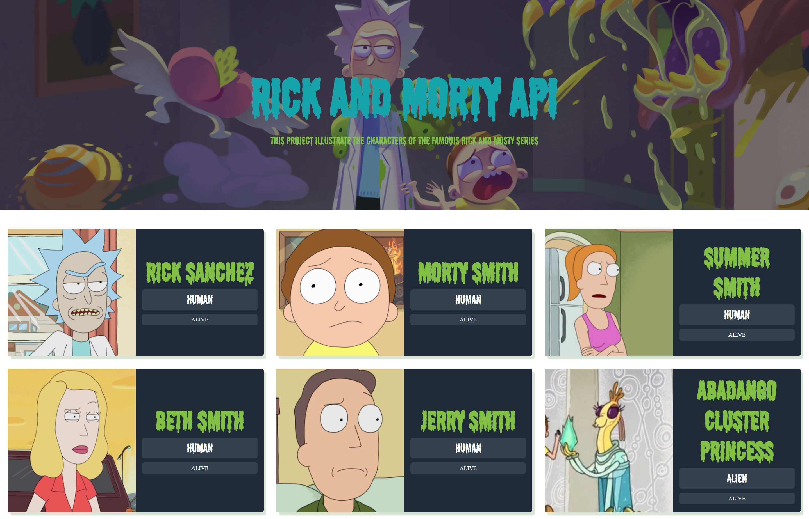

# API de Rick y Morty

   

Este proyecto ilustra los personajes de la famosa serie de Rick y Morty.

Esta desarrollada con Webpack, Babel y Sass.  

Los datos son consumidos de la Api "rickandmortyapi"

## Scripts

Instalamos las dependencias incluidas en el package.json

### `npm install`

El proyecto se inicializa utilizando:

### `npm run dev`

Corres la aplicación en modo desarrollo.

